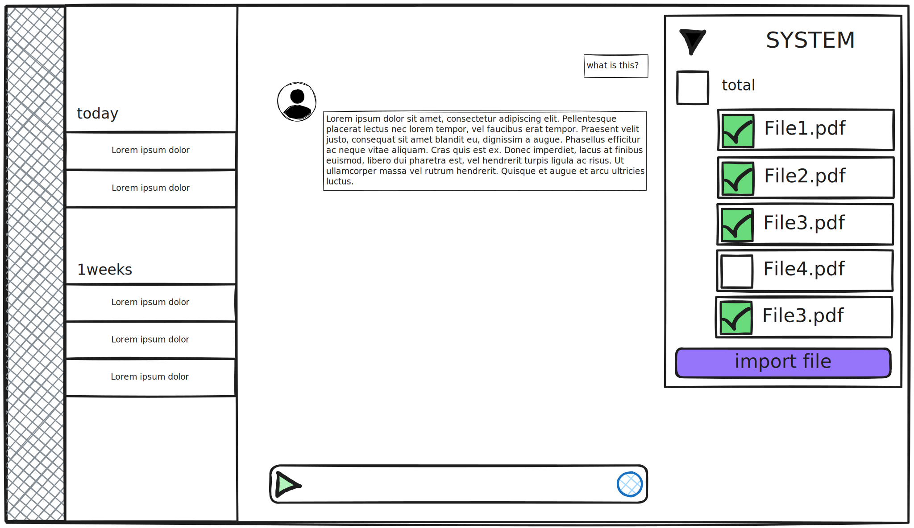
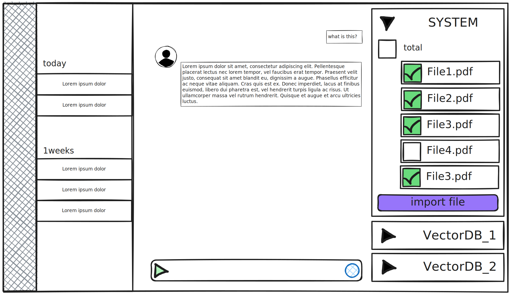

# VectorStore POC

여기서는 벡터스토어에 대한 내용을 다룬다. 현 위치의 문단은, 오로지 이 글이 작성될 초안인 시점에만 존재할 것이다. 이 문단은 이 글을 쓰는 목적을 전달하기 위해 쓰이며, 추후에는 지워질 것이다. `가장 먼저 말해야 할 것`은, 우리는 이 아이디어를 부르는 명칭이 없다는 것이다. 우리는 추상화를 하여 openai든 postgres DB를 이용하여 직접 vector 데이터를 다루든, 결국 하나의 인터페이스로 다룰 수 있게끔 하는 오픈소스 혹은 엔터프라이즈의 서비스를 만들 것인데 이름이 없어서는 안 된다. 따라서 이름은 결국 정해질 것인데, 어쨌거나 문서를 쓰는 시점에는 없는 것이 맞기 때문에 일단 vectorStore라고 부르겠다. 이는 openai의 beta 기능으로 이미 제공된 기능의 이름이 동일한 것이기 때문이다. `둘째`로 이 글은 나중에 모두 영어로 번역해야 한다. 다만 우리 팀이 읽기 편하게, 우선 한국어로 작성한다.

# 서론: 이 오픈소스의 목적

우리는 벡터스토어에 대한 오픈소스를 만들고자 한다. 후술하겠지만, 벡터스토어를 사용하는 것은 아직 개발적으로 그렇게 쉬운 일이 아니다. 확실히 Openai의 SDK를 사용하여 벡터스토어를 만드는 것은 이전에 비해 매우 쉬운 일이다. 하지만 "누구나" 쉽게 사용할 수 있는 것처럼은 보이지만, 그것은 어디까지나 개발자에게만 해당하는 일이다. 개발자 뿐만 아니라 모든 사람이 에이전트를 쉽게 사용할 수 있도록 만들려면 더 많은 기술적 도전을 해야 할 것이다. 또한 여기서 말하는 쉽다의 범위는 에이전트를 고정된 시나리오로 만들 때에나 그러한 일이다. 예를 들어, 어떤 커머스의 모든 상품 데이터를 벡터화하여 집어넣고 CS 에이전트를 만들었다고 한다면, 그 에이전트는 다른 쇼핑몰에서 사용하기는 어려울 것이다. 우리는 이러한 문제를 해결하고자 한다.

첫째, 시스템 프롬프트와 같이 에이전트에게 사전지식으로 활용될 파일들을 언제든 넣고 뺄 수 있게 할 것이다. 이 때 파일은 업로드됨에 동시에 에이전트의 사전지식에 포함되어, 유저는 자신의 에이전트를 쉽게 확장하거나 수정할 수 있을 것이다.

둘째, 우리는 에이전트에게 다수의 벡터 DB를 제공할 것이다. 벡터 DB는 개발적인 이유, 가령 DB가 MySQL이냐 Postgres냐, 그것도 아니면 검색엔진인지와 같은 서비스적인 요소 뿐만 아니라, 유저의 목적에 따라 다양한 기준으로 파일을 나눠 관리할 수 있게 될 것이다. 유저는 단순히 파일을 벡터 DB에 때려박는 식으로 에이전트를 만들길 원하지 않을 것이다. 파일을 기간에 따라 분류하고 싶을 수도 있고, 확장자에 따라 분류하고 싶을 수도 있다. 때로는 우선순위로 나누고 싶을 수도 있고, 어쨌거나 원하는 기준대로 하게 해줄 것이다.

셋째, 이 때, 벡터 DB는 충분히 추상화되어 Openai 뿐만 아니라 다양한 서비스를 이용할 수 있게 할 것이다. 동시에 벡터 DB와 무관한 파일 저장소도 함께 제공하여, 등록한 파일 중에서도 실제로 에이전트에게 제공한 것과 제공하지 않은 것을 구분할 수 있게 도와줄 것이다. 가령 유저는 100개의 파일을 등록해놓고 실제로는 1개만 사용할 수도 있지 않은가? 우리는 벡터 DB 외에도 파일 저장소를 제공해줄 것이다. 물론 이 또한 추상화가 되어, 로컬 메모리일 수도 있고 클라우드 상의 파일일 수도 있겠다.

# 벡터스토어에 대한 백그라운드 지식

```shell
curl https://api.openai.com/v1/chat/completions \
  -H "Content-Type: application/json" \
  -H "Authorization: Bearer $OPENAI_API_KEY" \
  -d '{
     "model": "gpt-4o-mini",
     "messages": [{"role": "user", "content": "Say this is a test!"}], # histories
     "temperature": 0.7
   }'
```

오픈소스에 대해서 얘기하기 전에, 우선 벡터스토어에 대한 생각을 조금 나누고 가자. 내 생각에 지금까지의 모든 에이전트는 히스토리 기반으로 말을 한다고 해도 과언이 아니라고 본다. Openai의 SDK로 API를 호출하는 과정을 봐보자. 물론 Openai에만 해당하는 것이 아니겠지만, 다 비슷한 느낌일 것이다. 위 코드에서 `messages` 부분에, 보통은 지금까지의 대화를 모두 인자로 넘겨서 결과 값을 받는다. 이는 말하자면 아래처럼 질문하는 것과 같다.

> _"이러한 상황에서 너라면 뭐라고 대답할래?"_

여기서 히스토리란 위 문장에서 말하는 '이러한 상황'의 확장이다. 누군가가 건넨 인사나 질문일 수도 있다. 또 그 말이 어떠한 맥락이 될 정도로 긴 상태에서의 질문일 수도 있다. 때로는 그 히스토리에 시스템 프롬프트라고 하여, 에이전트가 어떤 식으로 말해야 하는지 기호를 판단하거나 또는 성격을 드러내는 문장이 될 수도 있다. 어쨌거나 결국 모든 AI의 응답은, '이러한 상황에 너라면 뭐라고 대답할래?' 라고 질문한 것에 불과하다.

하지만 인간이 대화하는 방식은 지금까지의 맥락에 대한 반응과는 사뭇 다르다. 에이전트와의 대화는 각각의 채팅 스레드에서 이루어진다. 만약 에이전트에게 10가지의 주제로 말을 건다면, 그것은 곧 10가지의 스레드를 연 것이고, 유저 입장에서는 10개의 대화방에서 각기 다른 얘기를 하는 것과 같을 것이다. 뤼튼이라는 서비스의 캐릭터챗을 보자. 결국은 내부 모델이 무엇이든 간에, 많아 봐야 서너 개의 모델 중 하나를 골랐을 뿐인데, 캐릭터는 수천, 수만 개를 넘지 않는가? 하지만 인간이 대답하는 것은 인간의 생애주기 전체를 컨텍스트로 하여 이루어진다. 말하자면 인간의 생애 전체가 하나의 채팅방이다. 하나의 인간이 페르소나를 쓰던 쓰지 않던, 결국 그마저도 그 사람의 가치관에 달린 일이고, 하나의 컨텍스트로 이해할 수 있는 것이다. 예컨대 어떤 사람이 눈을 밟지 않는 이유는 하필 그 사람이 어렸을 때 눈을 밟고 넘어진 기억으로 인한 것일 수도 있듯이, 언제 어떤 질문을 하든 결국 자신의 인생 전체를 포괄하는 답을 할 수 밖에 없다. 우리가 부모에게 말을 할 때와 친구에게 말을 할 때, 연인에게 말을 할 때의 성격이 모두 달라도 우리는 우리 자신으로 보듯이.

물론, 다르게 말하면, 개발적인 관점에서 결국 하나의 스레드를 열고 인간의 생애주기만큼이나 대화를 하면 비슷한 효과를 낼 수 있을지도 모르겠다. 하지만 이런 방식은 정말 하나의 사람을 키우는 것만큼이나 긴 시간이 걸릴 것이고, 또한 인간은 에이전트처럼 텍스트만으로 지식, 경험을 습득하는 존재가 아니기 때문에 더 더욱 어렵고 비효율적인 방법일 것이다. 우리도 우리의 언어로 표현 못하는 개념들이 즐비할 텐데 이것들은 무슨 수로 가르친단 말인가. 벡터스토어는 필자가 이해하기에 결국 이런 문제점을 커버하기 위해 만들어진 기능이다. 인간과 같이, 하나의 에이전트에게 대용량의 데이터를 **"단 한 번에" 전달하여** 그로 하여금 대답을 하게끔 만드는 것이다. 나는 이러한 상황에서 벡터스토어에 대한 필요성이 생겨났다고 바라보고 있다.

## Openai에서의 벡터스토어 사용 방식

```ts
// 너무 자세한 내용은 생략한다.
// 자세히 서술할 생각이 없다. 이 글을 읽는 사람들은 거진 대부분 이미 할 줄 알 것이고,
// 모른다고 하더라도 목적이 Openai SDK를 배우는 것이 아닐 테니깐.
// 추후 작성하겠음.
```

# 우리가 구현하고자 하는 것

우리는 Tool Calling만 가지고 벡터스토어를 다루는 법을 연구할 것이다. 이는 목적 중 하나였던 동적으로 파일을 넣고 빼는 것을 만들기 위함이다. 개인적으로는 이는 사람이 생각하는 것과 굉장히 유사한 방식이라고 생각한다. 사람들은 복잡한 지식을 요하는 질문을 받으면 자신이 배운 것들을 떠올리는 과정이 필요하다. 우리는 이를 Tool Calling이라는 방식으로 추상화하고자 한다. Agent가 대답하기 어려운 상황이 있을 때, 우선 그 지식이 저장된 저장소를 생각해내야 한다. 가령 우리가 과거 대학교 시절 배운 전공 내용에 대한 질문을 받으면 머릿속으로 _'음, 이건 건축학에 관한 질문이군. 그 때 뭘 배웠더라?'_ 하고 떠올리는 것과 같다. 또, 이러한 방식이 지식을 카테고리화하여 다루기에도 더 적합할 거라고 판단한다.

## 시스템 프롬프트로서 파일을 사용하는 것



예를 들어 대화방에서 위와 같이 말을 한다고 해보자. _( 여기서는 오픈소스에 대한 것을 얘기할 거지만, 이해하기 편하게 UI까지 그려보았다. )_ 우리의 오픈소스를 사용한다고 가정했을 때, 위와 같은 서비스를 만들 수 있을 것이다. 유저는 Agent와 대화를 할 때, 우측 패널을 이용해서 쉽게 파일을 업로드할 수 있다. 하지만 파일이 부적합하다고 판단된 경우, 언제든 벡터 DB, 여기서는 System 이라고 명명된 DB로부터 파일을 해제할 수도 있을 것이다. 파일을 넣고 빼는 시점을 기준으로 Agent는 즉시 파일 내용을 기반으로 삼아 대화할 준비가 완료되는 것이다. _( 또는 해당 파일이 프로세싱되는 동안 대기한 후 대화하면 될 것이다. )_

## 다수의 벡터스토어 사용

### 한 플랫폼에서 벡터스토어를 사용할 때의 문제

### 다수의 벡터스토어 제공 방법


